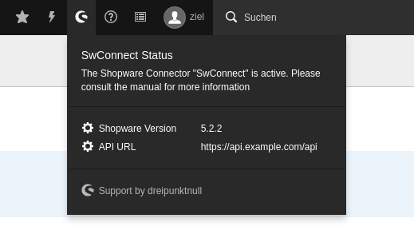

.. ==================================================
.. FOR YOUR INFORMATION
.. --------------------------------------------------
.. -*- coding: utf-8 -*- with BOM.

.. include:: ../../Includes.txt

.. _admin-manual-toolbar-items:

The Toolbar Item
===================

		Shopware Connector Toolbar Item

The extension features a Toolbar Item in the backend that shows the current
status of the extension and several Shopware related pieces of information.

The displayed items can be re-arranged and custom items can be added.

Custom Status indicator
-----------------------

It is possible to extend the information displayed through using the Signal/Slot Dispatcher.

In your own sitepackage extensions `ext_localconf.php`, connect a slot to the corresponding signal:

.. code-block:: php

	/**
	 * Signals / Slots
	 */

	/** @var \TYPO3\CMS\Extbase\SignalSlot\Dispatcher $signalSlotDispatcher */
	$signalSlotDispatcher = \TYPO3\CMS\Core\Utility\GeneralUtility::makeInstance(\TYPO3\CMS\Extbase\SignalSlot\Dispatcher::class);

	/**
	 * Add Status Information to the Toolbar Item
	 */
	$signalSlotDispatcher->connect(
		 \DPN\SwConnect\Backend\ToolbarItems\SwConnectToolbarItem::class,
		 \DPN\SwConnect\Backend\ToolbarItems\SwConnectToolbarItem::SIGNAL_COLLECT_STATUS,
		 \Vendor\MyExt\Slot\StatusCollectorSlot::class,
		 'collect'
	);

	unset($signalSlotDispatcher);

Then create a slot class that implements the `\\DPN\\SwConnect\\Backend\\ToolbarItems\\SwConnectToolbarItemInterface` interface:

.. code-block:: php

	namespace Vendor\MyExt\Slot;

	use Doctrine\Common\Collections\ArrayCollection;
	use DPNSwConnect\Backend\ToolbarItems\SwConnectToolbarItemInterface;

	/**
	 * My custom status collector
	 */
	class StatusCollectorSlot implements StatusCollectorSlotInterface
	{
		 /**
		  * Called by the Dispatcher. To add a Status Item, use
		  * the following code:
		  *
		  * $reports->add([
		  *   'iconIdentifier' => 'my-icon-identifier',
		  *   'title'          => 'My Title',
		  *   'titleAddition'  => null,
		  *   'value'          => 'super nice value',
		  *   'status'         => 'success', // success, warning, info
		  *   'priority'       => 200,
		  * ]);
		  *
		  * The priority index manipulates the order of
		  * appearance.
		  *
		  * @param ArrayCollection $reports
		  */
		 public function collect(ArrayCollection $reports)
		 {
			  $reports->add([
					'iconIdentifier' => 'my-icon',
					'title' => 'My Indicator',
					'titleAddition' => null,
					'value' => 'Hello World',
					'status' => 'success',
					'priority' => 200,
			  ]);
		 }
	}
